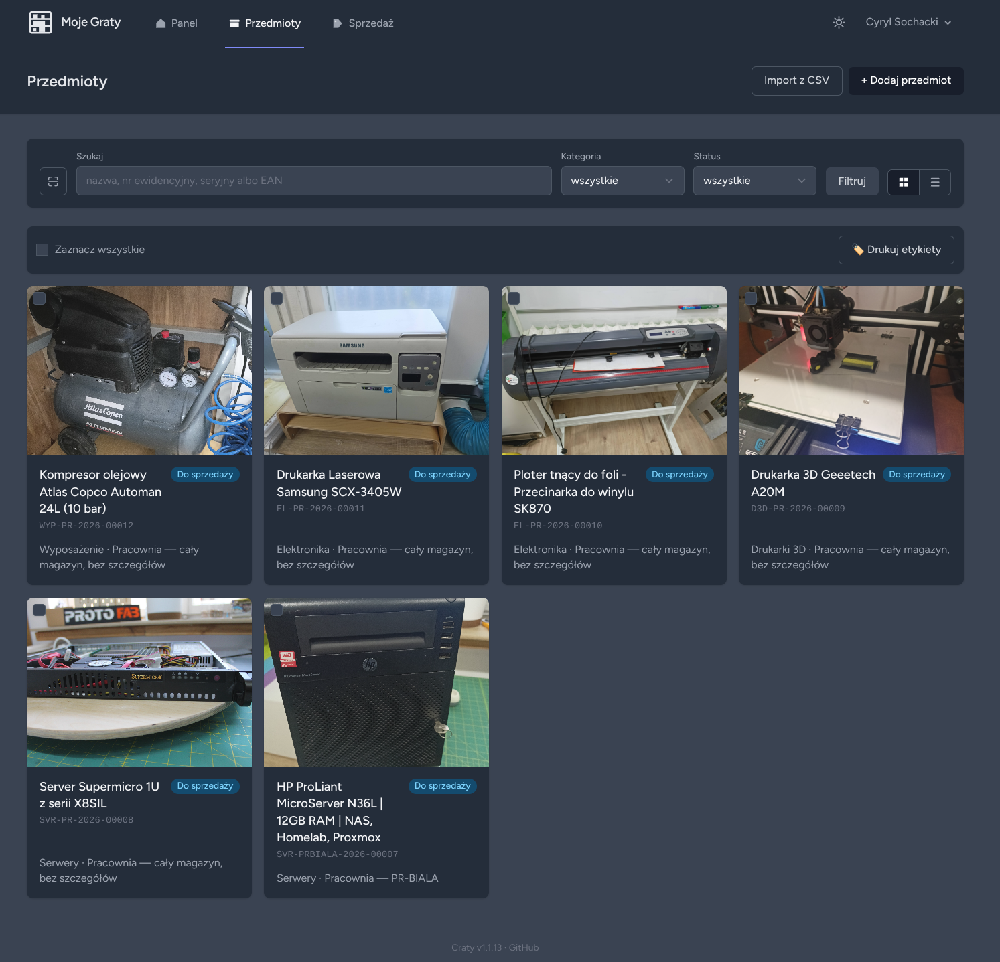

# Craty

*[Read this in English →](README.en.md)*

Prosta aplikacja do ewidencji sprzętu i magazynu w warsztacie/pracowni:
kategorie, lokalizacje (magazyn → regał → półka → pojemnik), automatyczne
numery ewidencyjne z kodami QR, kartoteka przedmiotu (zdjęcia, specyfikacja,
wartość, stan), wypożyczenia, historia zmian i na razie uproszczony eksport
ofert sprzedaży do CSV. Do tego publiczna strona „pchli targ” dla wystawionych ofert,
webowy instalator i moduł samo-aktualizacji przez panel administratora.



Do tego appka instaluje się jako PWA na telefonie/tablecie i skanuje kody QR
oraz kreskowe (EAN/UPC) wprost kamerą przeglądarki — nietrafiony skan
proponuje szybkie dodanie nowego przedmiotu.

Zbudowana na Laravel 12 + MariaDB, w pełni dwujęzyczna (PL/EN).

> Skąd nazwa? „Craty” to połączenie polskiego „Graty” (sprzęt/rupiecie w
> warsztacie) i angielskiego „crate” (skrzynka) — appka zaczynała jako
> wewnętrzne narzędzie „Graty” i zachowała podobne brzmienie przy zmianie
> nazwy na wersję open source.

## Założenia: to program magazynowy, nie sklep

Craty jest i zostanie **prostym programem do ewidencji magazynu**. Nigdy nie
stanie się pełnoprawnym sklepem internetowym: nie ma i nie będzie w nim
koszyka, składania zamówień, płatności online, wysyłek ani obsługi
klientów jak w sklepie.

Funkcje sprzedaży ograniczają się celowo do dwóch rzeczy:

- **kontakt z właścicielem**: publiczna strona „pchli targ” pokazuje, co
  jest do sprzedania, a zainteresowany pisze albo dzwoni na podany e-mail
  lub telefon i dalej umawiacie się sami, lokalnie;
- **linki do popularnych serwisów ogłoszeniowych**, takich jak OLX,
  Allegro czy Vinted, gdzie ta sama rzecz może być wystawiona.

Propozycje rozbudowy w stronę sklepu (koszyk, płatności, zamówienia)
będą odrzucane jako niezgodne z założeniami projektu.

## Wymagania (własny hosting)

Dotyczy instalacji poza Dockerem (patrz [Wdrożenie na hostingu](#wdrożenie-na-hostingu-bez-dockera-i-ssh)
niżej) — kreator instalacji (`/install`) sam sprawdza to wszystko i pokazuje,
czego ewentualnie brakuje, zanim pozwoli przejść dalej.

- **PHP ≥ 8.3**
- Rozszerzenia PHP: `pdo_mysql`, `mbstring`, `gd`, `zip`, `bcmath`, `exif`, `intl`
- **MySQL 8+ lub MariaDB 10.3+**
- **Apache z `mod_rewrite` i `AllowOverride All`.** Appka nie ma osobnego
  katalogu `public/` — cały kod (w tym `.env`) leży w tym samym katalogu co
  `index.php`, a jego ochrona przed dostępem z przeglądarki zależy
  wyłącznie od reguł w `.htaccess`. Bez `AllowOverride All` (domyślne
  ustawienie wielu hostingów to `AllowOverride None`) Apache po cichu
  ignoruje te reguły i cały kod źródłowy staje się publicznie pobieralny.
  Nginx nie czyta `.htaccess` w ogóle, więc wymagałby ręcznego przepisania
  tych reguł na konfigurację Nginx — appka nie dostarcza tego gotowego.
- Zapis (uprawnienia dla użytkownika PHP) do katalogów `app-storage/` i
  `bootstrap/cache/`
- **HTTPS** — wymagany do skanowania kamerą (PWA) i realnie zalecany zawsze;
  zwykły HTTP na produkcji przeglądarki traktują jako niebezpieczny
  kontekst i blokują dostęp do kamery

## Szybki start (Docker)

```bash
git clone https://github.com/cyryllo/craty.git
cd craty
cp .env.example .env
docker compose up -d
npm install && npm run build
./art migrate --seed
```

Aplikacja: http://localhost:8000 — konta startowe (hasło: `password`):
`admin@craty.test`, `magazynier@craty.test`.

**Własne dane logowania do bazy:** przed pierwszym `docker compose up`
zmień `DB_DATABASE`/`DB_USERNAME`/`DB_PASSWORD` (i opcjonalnie
`DB_ROOT_PASSWORD`) w pliku `.env` — Docker Compose czyta ten sam plik, więc
kontener MariaDB założy bazę/użytkownika z tymi wartościami. Zmiana tego
już PO pierwszym uruchomieniu (gdy wolumen bazy istnieje) nic nie da — trzeba
wtedy usunąć wolumen (`docker compose down -v`) i wystartować od nowa.

## Wdrożenie na hostingu (bez Dockera i SSH)

Appka ma webowy kreator instalacji pod `/install` — sam generuje `.env`,
prosi o dane do bazy i zakłada konto administratora. Nie trzeba composera
ani npm na serwerze — `vendor/` i zbudowany frontend (`build/`) są już w
środku paczki.

`php artisan release:build` (uruchamiane w tym repo, nie na hostingu)
produkuje **jedną** paczkę do `app-storage/app/releases/craty-{wersja}.zip`
— appka nie ma osobnego katalogu `public/` (patrz `.htaccess`/`index.php`
w korzeniu repo), więc ta sama paczka służy zarówno do świeżej instalacji,
jak i do aktualizacji już postawionej instalacji przez panel:

- **Świeża instalacja:** rozpakuj **całą zawartość wprost do document
  rootu** (`public_html` albo odpowiednik u Twojego hostingu) — bez żadnej
  ręcznej edycji. Paczka ma już gotowy `index.php` i pliki `.htaccess`
  blokujące dostęp z przeglądarki do `.env`, kodu źródłowego i `vendor/`.
  Wejdź na `/install`.
- **Aktualizacja:** zaloguj się jako admin → Ustawienia → Aktualizacje →
  wgraj tę samą paczkę. `.env` i dane użytkowników (`app-storage/app/
  public`, `app-storage/logs`, symlink `storage`) nigdy nie są nadpisywane.

**Limit rozmiaru wgrywanego pliku:** paczka to zwykle kilkanaście–
kilkadziesiąt MB (zawiera cały `vendor/` i skompilowany frontend), a
domyślne limity PHP (`post_max_size`, zwykle 8M; `upload_max_filesize`,
zwykle 2M) tego nie przepuszczą — upload padnie z błędem `413 Content Too
Large`, zanim żądanie w ogóle dotrze do aplikacji. Obraz Dockera z tego
repo ma to już podniesione (`128M`), ale na zwykłym hostingu trzeba
samodzielnie podbić obie wartości w `php.ini` (albo w `.htaccess`/panelu
hostingu, jeśli nie ma dostępu do `php.ini`) i zrestartować PHP/serwer.

**Skanowanie kamerą wymaga HTTPS** (albo `localhost`, stąd działa bez
niczego dodatkowego na dev) — przeglądarki nie dają dostępu do kamery na
zwykłym HTTP w produkcji. Zadbaj o certyfikat, zanim ktoś się zdziwi, że
„skaner nie działa”.

## Bezpieczeństwo

Po każdej aktualizacji warto sprawdzić swoją instalację skryptem z
repozytorium:

```bash
./security-check https://twoja-domena.pl
```

Skrypt wykonuje wyłącznie zapytania odczytu, bez logowania, więc można go
bezpiecznie uruchamiać na produkcji. Sprawdza, czy nie da się pobrać plików
z kodem lub hasłami, czy nie ma listingu katalogów, czy panel wymaga
logowania, czy strona błędu nie zdradza szczegółów, oraz nagłówki,
ciasteczka i przekierowanie na HTTPS. Uprawnienia do każdej strony
aplikacji i typowe ataki (wgrywanie skryptów, wstrzykiwanie kodu)
sprawdzają automatyczne testy w `tests/Feature/Security/`.

Znalazłeś lukę bezpieczeństwa? Zgłoś ją prywatnie przez
[GitHub Security Advisories](https://github.com/cyryllo/craty/security/advisories/new),
a nie w publicznym zgłoszeniu.

## Jak pomóc

Craty to młody projekt rozwijany po godzinach i **szukam osób, które będą
go używać**. Nie trzeba umieć programować, żeby pomóc:

- **Używaj i mów, co nie działa.** Każdy błąd zgłoszony przez
  [formularz zgłoszenia błędu](https://github.com/cyryllo/craty/issues/new?template=bug_report.yml)
  przybliża stabilną wersję. Zrzut ekranu i numer wersji (widać go w
  stopce) bardzo pomagają.
- **Podziel się pomysłem.** Brakuje Ci czegoś w codziennym porządkowaniu
  gratów? Opisz to w
  [formularzu propozycji](https://github.com/cyryllo/craty/issues/new?template=feature_request.yml),
  najlepiej na przykładzie z życia.
- **Powiedz innym.** Gwiazdka na GitHubie i polecenie Craty znajomym z
  warsztatu, hackerspace'u czy grupy majsterkowiczów naprawdę pomagają.
- **Programujesz?** Pull requesty są mile widziane. Przy większej zmianie
  najlepiej najpierw opisz ją w zgłoszeniu, żebyśmy ustalili kierunek.

Zgłaszać można po polsku albo po angielsku.

## Plany na przyszłość

Craty rozwija się dalej, głównie przez **moduły rozszerzające**, które
będzie można włączyć w ustawieniach, gdy są potrzebne, i wyłączyć, gdy
nie są. W planie są między innymi:

- **Kontakty**: osoby i firmy, którym wypożyczasz rzeczy, oraz serwisy,
  do których wysyłasz sprzęt do naprawy, z historią wypożyczeń przy
  każdym kontakcie.
- **Serwis**: naprawy, przeglądy okresowe i gwarancje, czyli pełniejsza
  historia „co się działo z tym sprzętem”.
- **Protokoły wypożyczenia i zwrotu** jako gotowe do druku dokumenty PDF.
- **Materiały eksploatacyjne**: rzeczy liczone w sztukach, metrach czy
  litrach, z ostrzeżeniem, gdy zaczyna ich brakować.

Kolejność i szczegóły nie są jeszcze ustalone. **Masz pomysł albo
potrzebę, której Craty dziś nie spełnia?** Opisz ją w
[zgłoszeniach na GitHubie](https://github.com/cyryllo/craty/issues).
Każdą fajną funkcję rozważę, o ile pasuje do założeń projektu (program
magazynowy, nie sklep).

## Dokumentacja

- [INSTRUKCJA.md](INSTRUKCJA.md) — instrukcja użytkownika (główne funkcje,
  struktura magazynowa)
- [CHANGELOG.md](CHANGELOG.md) — historia zmian

## Licencja

[MIT](LICENSE)
